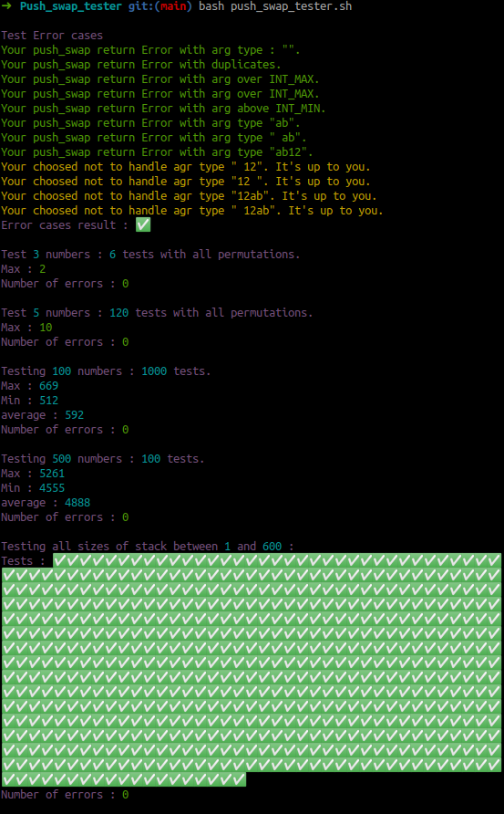
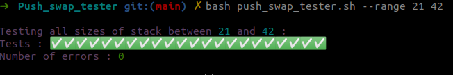

# Push_swap_tester
A bash tester for the Push_swap project of 42 school



### Usage
Get inside your push_swap path and :
```bash
git clone https://github.com/cberganz/Push_swap_tester.git
cd push_swap_tester
bash push_swap_tester.sh
```

### Help menu
Display help menu :
```bash
bash push_swap_tester.sh --help
```


### Use another checker / change checker path
By default the script uses the linux checker with the path ../checker_linux. You can change the default checker path to the MacOS Checker or to your own checker with :
```bash
bash push_swap_tester.sh [optional - checker path]
```

If you use the MacOS checker
```bash
bash push_swap_tester.sh ../checker_Mac
```

If you use your personal checker named "checker"
```bash
bash push_swap_tester.sh ../checker
```


### Free mode
You can run a test with the settings of your choice :
```bash
bash push_swap_tester.sh [optional - checker path] [optional - stack size] [optional - Number of tests]
```
(Default value for number of tests is 1).


### Sequence mode
Your can run a sequencial test with the range of your choice :
```bash
bash push_swap_tester.sh -seq [optional - checker path] [mandatory - sequence begin] [mandatory - sequence end]
```



### Memory check mode
Use valgrind to run a memory check with the stack size specified :
```bash
bash push_swap_tester.sh --memory [mandatory - stack size]
```

